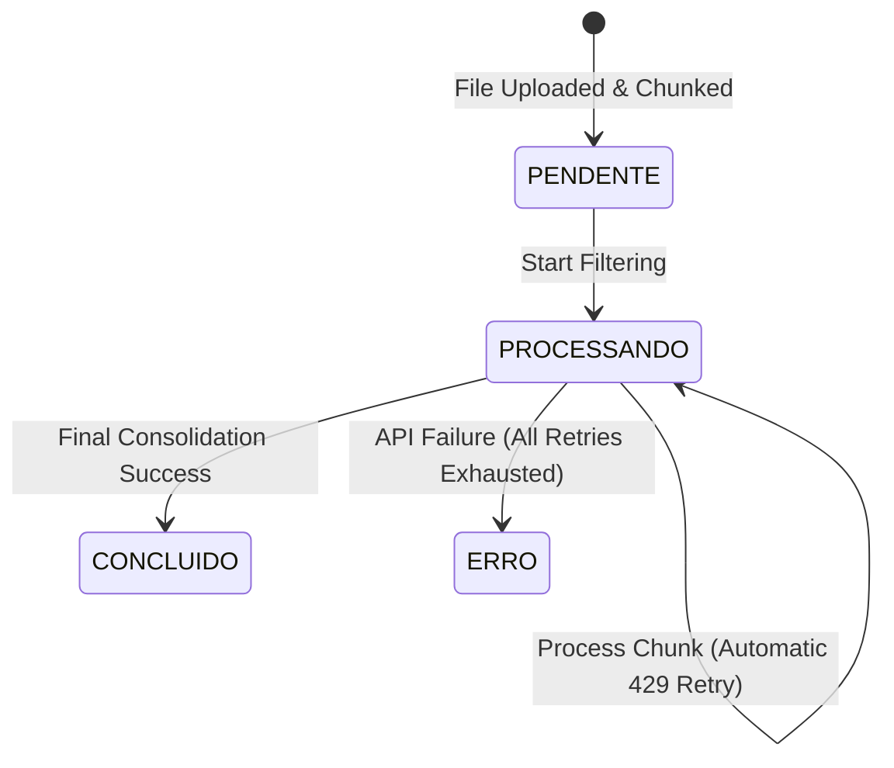

# Data Model: Extrator e Filtro de P&R (Local)

This document specifies the schemas, validation rules, and state transitions for the application's entities.

---

## 1. Entities & Fields

### A. ChaveAPI (Persisted: JSON on Docker Volume)
Represents a user's OpenAI credential.

| Field | Type | Description | Validation |
| :--- | :--- | :--- | :--- |
| `id` | `string (UUID)` | Unique identifier | Must be a valid UUID v4 |
| `nomeIdentificacao` | `string` | Friendly name for selection | Unique, 1-100 characters, no leading/trailing whitespace |
| `chave` | `string` | The API Key value | Must start with `sk-` (or match OpenAI key format) and not be empty |

### B. PromptConfig (Persisted: JSON on Docker Volume)
Represents the extraction configuration and prompt directives.

| Field | Type | Description | Validation |
| :--- | :--- | :--- | :--- |
| `id` | `string (UUID)` | Unique identifier | Must be a valid UUID v4 |
| `nome` | `string` | Friendly name | 1-100 characters |
| `tipo` | `string` | System default or custom user prompt | Must be either `"FIXO"` or `"CUSTOMIZADO"` |
| `textoInstrucao` | `string` | Main LLM system instructions | Required for `"CUSTOMIZADO"`; length 10-5000 characters |
| `palavrasChave` | `string[]` | Keyword filters (optional) | Array of strings |
| `idiomaModelo` | `string` | Output target language | Must be standard language code/name (default: `"pt-br"`) |
| `modeloOpenAI` | `string` | Selected LLM model | Must be either `"gpt-4o-mini"` or `"gpt-4o"` (default: `"gpt-4o-mini"`) |

### C. ArquivoProcessamento (In-Memory)
Represents a file uploaded by the user for processing.

| Field | Type | Description | Validation |
| :--- | :--- | :--- | :--- |
| `id` | `string (UUID)` | Unique identifier | Must be a valid UUID v4 |
| `nomeArquivo` | `string` | Original file name | Must end with a supported extension (e.g. `.txt`) |
| `tamanho` | `integer` | File size in bytes | Must be > 0 |
| `conteudoBruto` | `string` | Complete raw text content | Max 1,000,000 characters (Success Criteria limit) |
| `chunks` | `string[]` | Smart text slices | Array of strings |
| `status` | `string` | Processing state | Must be `"PENDENTE"`, `"PROCESSANDO"`, `"CONCLUIDO"`, or `"ERRO"` |

### D. ResultadoParPR (In-Memory / Final Export)
Represents an extracted, grouped, and consolidated Q&A pair.

| Field | Type | Description | Validation |
| :--- | :--- | :--- | :--- |
| `perguntaPadronizada` | `string` | Semantic unified question | Not empty |
| `respostaConsolidada` | `string` | Consolidated answer | Not empty |
| `frequencia` | `integer` | Cumulative count of occurrences | Must be >= 1 |
| `metadata` | `string` | Associated context keywords / tags | Optional |
| `category` | `string` | Categorization group | Must not be empty |

### E. ItemLog (In-Memory)
Represents an execution event displayed in the real-time log area.

| Field | Type | Description | Validation |
| :--- | :--- | :--- | :--- |
| `timestamp` | `string` | Time of the event | Format: `HH:MM:SS` |
| `tipo` | `string` | Event classification | Must be `"INFO"`, `"SUCESSO"`, or `"ERRO"` |
| `mensagem` | `string` | Event details | Not empty |

---

## 2. State Transitions (ArquivoProcessamento)

The processing status of an upload transitions as follows:

- **PENDENTE**: Initial state. File is uploaded, split into chunks, and placed in the FIFO queue.
- **PROCESSANDO**: The system is actively executing chunk requests one-by-one against the OpenAI API.
- **CONCLUIDO**: All chunks have been successfully processed, and results have been consolidated and populated on screen.
- **ERRO**: An API request has failed (e.g., key expired or rate limits persisted past 3 retries). The queue halts.
