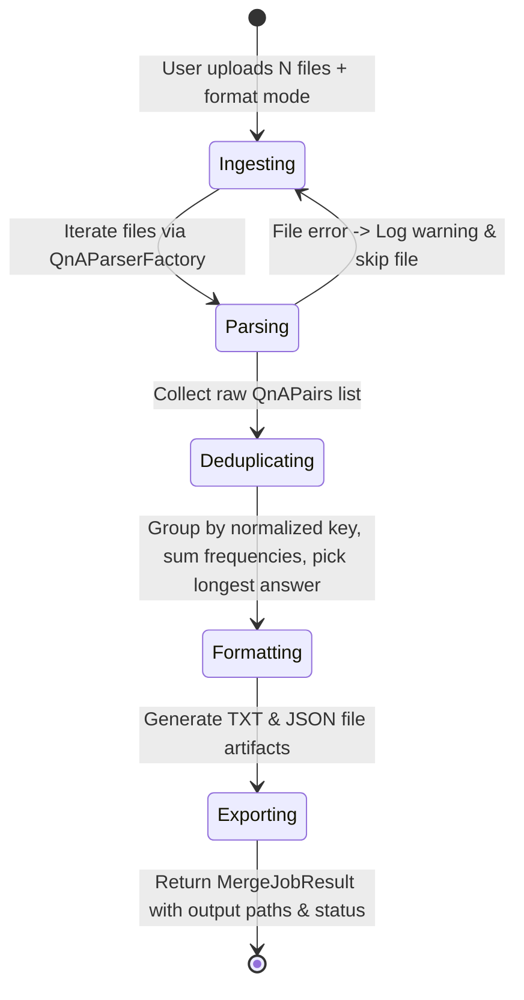

# Data Model: Consolidated Question & Answer Document Merger

## Entities

### 1. QnAPair
Represents a single question and answer item extracted from or compiled for a document.

| Field | Type | Description | Constraints / Validation |
|-------|------|-------------|--------------------------|
| `perguntaPadronizada` | String | The standard question text | Non-empty |
| `respostaConsolidada` | String | The answer text | Non-empty |
| `frequencia` | Integer | Occurrence frequency count | Must be >= 1 |
| `metadata` | String (Optional) | Document/category tags or metadata string | Optional |
| `category` | String (Optional) | Categorization string | Optional |

### 2. MergeJobRequest
Input parameters for triggering a document merge operation.

| Field | Type | Description | Constraints / Validation |
|-------|------|-------------|--------------------------|
| `format` | Enum (`json`, `txt`) | Input format of files being submitted | Required |
| `files` | List of UploadFile | Array of file payloads | At least 1 file required |

### 3. MergeJobResult
Output result returned to the client upon processing completion.

| Field | Type | Description |
|-------|------|-------------|
| `success` | Boolean | Overall operation success flag |
| `total_files_processed` | Integer | Count of valid files successfully parsed |
| `total_qna_extracted` | Integer | Raw count of Q&A pairs extracted before deduplication |
| `total_qna_merged` | Integer | Final count of unique Q&A pairs after merging |
| `json_output_url` | String | Download/file URL for generated `.json` output |
| `txt_output_url` | String | Download/file URL for generated `.txt` output |
| `warnings` | List of String | Warnings for skipped or malformed files |
| `qna_pairs` | List of QnAPair | The merged Q&A dataset |

## State Transitions & Flow

