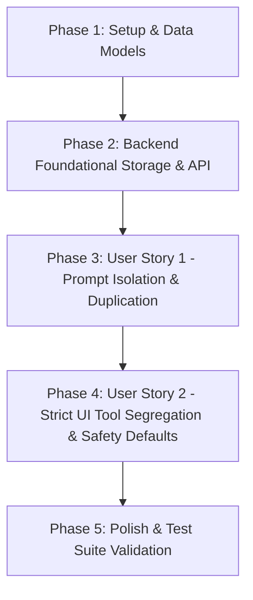

# Tasks: Separação e Isolamento de Gerenciamento de Prompts por Ferramenta

**Feature Branch**: `005-separate-tool-prompts`  
**Spec**: [`specs/005-separate-tool-prompts/spec.md`](file:///mnt/D_DADOS/02_Projetos_Ativos/Vet_Manager/Projects/filtro_whatsapp/specs/005-separate-tool-prompts/spec.md)  
**Plan**: [`specs/005-separate-tool-prompts/plan.md`](file:///mnt/D_DADOS/02_Projetos_Ativos/Vet_Manager/Projects/filtro_whatsapp/specs/005-separate-tool-prompts/plan.md)

---

## Task Dependencies & Execution Order

---

## Phase 1: Setup & Foundational Schemas

- [ ] T001 [P] Update `TipoFerramenta` enum to include `CONSOLIDADOR = "consolidador"` in `backend/src/models/schemas.py`
- [ ] T002 [P] Update `TipoFerramenta` TypeScript type in `frontend/src/services/api.ts` to include `"consolidador"`

---

## Phase 2: Backend Storage & API Filtering

- [ ] T003 Update system prompt constants and initialization logic in `backend/src/services/prompt_storage.py` using factory pattern / dependency injection structure to ensure built-in default prompts exist for `EXTRATOR`, `GERADOR`, and `CONSOLIDADOR`
- [ ] T004 Update `GET /api/prompts/default` endpoint in `backend/src/api/routes/prompts.py` to accept optional `ferramenta` query parameter and return default prompt text per tool
- [ ] T005 [P] Add backend unit tests in `backend/tests/test_prompts.py` for default prompt retrieval per tool, tool association persistence (FR-006), and deletion protection

---

## Phase 3: User Story 1 - Gerenciamento e Duplicação de Prompt Padrão por Ferramenta (Priority: P1)

**Story Goal**: Permitir que cada ferramenta possua sua lista de prompts isolada e que a ação de editar o prompt padrão gere uma cópia editável `<Nome Padrão> (Cópia)` associada exclusivamente à respectiva ferramenta.

**Independent Test**: Acessar o gerenciador de prompts, alternar a ferramenta ativa, clicar em "Duplicar/Editar" no prompt padrão e verificar se a cópia `<Nome Padrão> (Cópia)` é criada exclusivamente na lista daquela ferramenta.

- [ ] T006 [US1] Update `usePrompts` hook in `frontend/src/services/prompts.ts` to pass `ferramenta` parameter to `fetchDefaultPromptText` and maintain reactive tool state
- [ ] T007 [US1] Update `PromptSettings.tsx` in `frontend/src/components/PromptSettings.tsx` to include a tool selector tab/filter, scoped prompt listing, and automatic `<Nome Padrão> (Cópia)` pre-fill naming on default duplication
- [ ] T008 [US1] Add frontend tests in `frontend/tests/prompts.test.tsx` for tool-scoped prompt loading, creation with tool binding, and default duplication naming

---

## Phase 4: User Story 2 - Isolamento Estrito de Listas de Prompts entre Ferramentas (Priority: P2)

**Story Goal**: Garantir que prompts de uma ferramenta não vazem na interface ou nos seletores de outras ferramentas e que o fallback de exclusão retorne para o prompt padrão da ferramenta correspondente.

**Independent Test**: Selecionar prompts no `StartProcessModal` de cada ferramenta e verificar que apenas prompts vinculados à ferramenta atual são exibidos, e ao excluir um prompt customizado selecionado a seleção reverte para o prompt padrão correspondente.

- [ ] T009 [US2] Update `StartProcessModal.tsx` in `frontend/src/components/StartProcessModal.tsx` to enforce tool filtering on prompt selection dropdown and auto-revert to the tool's default prompt if the current custom selection is deleted
- [ ] T010 [US2] Update `ExtractorPanel.tsx` and `GeneratorPanel.tsx` in `frontend/src/components/` to pass explicit `ferramenta` prop ("extrator" / "gerador") to modal and settings context

---

## Phase 5: Polish & Test Suite Validation

- [ ] T011 Run and fix all backend unit tests via `backend/tests/test_prompts.py`
- [ ] T012 Run and fix all frontend test suites via `npm test -- --run` in `frontend/`

---

## Implementation Strategy & MVP Scope

- **MVP Scope**: Phase 1 through Phase 3 (User Story 1 - Isolamento e duplicação funcional por ferramenta).
- **Parallel Opportunities**:
  - T001 (Backend Schema) e T002 (Frontend Type) podem ser executados em paralelo.
  - T005 (Backend Tests) e T008 (Frontend Tests) podem ser preparados em paralelo aos seus respectivos desenvolvimentos.
