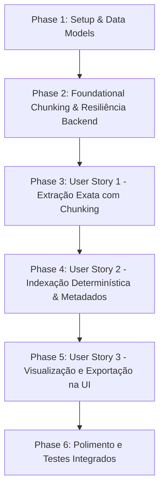

# Tasks: Extração Exata de Perguntas e Respostas do WhatsApp (006-exact-qa-extractor)

**Feature Branch**: `006-exact-qa-extractor`  
**Spec**: [`spec.md`](file:///mnt/D_DADOS/02_Projetos_Ativos/Vet_Manager/Projects/filtro_whatsapp/specs/006-exact-qa-extractor/spec.md)  
**Plan**: [`plan.md`](file:///mnt/D_DADOS/02_Projetos_Ativos/Vet_Manager/Projects/filtro_whatsapp/specs/006-exact-qa-extractor/plan.md)  
**Status**: Draft / Pending Execution

---

## Task Execution Order & Dependencies

---

## Phase 1: Setup & Data Models

Goal: Garantir os modelos de dados Pydantic e estruturas de entrada/saída para chunking, deduplicação e resiliência JSON.

- [X] T001 [P] Atualizar modelos Pydantic em `backend/src/models/exact_qa.py` incluindo suporte a `ChunkConfig`, metadados de progresso e deduplicação de pares.

---

## Phase 2: Foundational Chunking & Resiliência Backend

Goal: Implementar a infraestrutura básica de divisão por chunks com sobreposição e chamadas resilientes à LLM no backend.

- [X] T002 Implementar método de divisão em chunks com overlap de 20 mensagens em `backend/src/services/exact_extractor.py`.
- [X] T003 Implementar resiliência com `max_tokens=4000`, validação de integridade JSON e retry automático (mecanismo contra `json.JSONDecodeError`) em `backend/src/services/exact_extractor.py`.
- [X] T004 Atualizar o System Prompt `EXACT_QA_SYSTEM_PROMPT` em `backend/src/services/exact_extractor.py` instruindo a ignorar saudações sem dúvida e descarte de placeholders (`<Ficheiro não revelado>`, `<Mídia omitida>`).

---

## Phase 3: User Story 1 - Extração Exata com Chunking (P1)

Goal: Extrair pares P&R processando grandes conversas em chunks sem perda de contexto e mantendo fidelidade textual 100%.

- [X] T005 [US1] Atualizar `extract_mappings_with_llm` em `backend/src/services/exact_extractor.py` para iterar sobre os chunks, agregando e deduplicando pares de `(question_id, answer_id)`.
- [X] T006 [P] [US1] Atualizar endpoint WebSocket `/api/exact-extractor/extract-ws` em `backend/src/api/exact_extractor_ws.py` transmitindo status de progresso chunk a chunk para o cliente.
- [X] T007 [P] [US1] Escrever testes unitários em `backend/tests/test_exact_extractor.py` validando o fatiamento em chunks, deduplicação e resiliência a retornos malformados da LLM.

---

## Phase 4: User Story 2 - Indexação Determinística & Metadados (P2)

Goal: Garantir parser determinístico limpo com descarte prévio ou rotulagem adequada de placeholders e ruídos.

- [X] T008 [P] [US2] Atualizar parser determinístico em `backend/src/services/exact_parser.py` para identificar e rotular ou isolar mensagens de mídias/placeholders conhecidos.
- [X] T009 [P] [US2] Escrever testes unitários em `backend/tests/test_exact_parser.py` testando mensagens multilinhas, emojis e mensagens de cortesia sem pergunta.

---

## Phase 5: User Story 3 - Visualização e Exportação na UI (P3)

Goal: Atualizar a interface React no frontend para exibir progresso do chunking em tempo real e exportação dos resultados exatos.

- [X] T010 [P] [US3] Atualizar tipos TypeScript em `frontend/src/types/exactQA.ts` alinhados com os novos payloads do WebSocket (progresso por chunk).
- [X] T011 [US3] Atualizar serviço de API WebSocket no frontend `frontend/src/services/exactExtractorService.ts` para processar eventos de progresso de chunks.
- [X] T012 [US3] Atualizar componente da interface `frontend/src/components/ExactExtractorPanel.tsx` para mostrar barra de progresso visual do chunking e estatísticas dos pares reconstruídos exatos.

---

## Phase 6: Polimento e Testes Integrados

Goal: Validar a integração completa do extrator exato e executar a suíte de testes.

- [X] T013 Executar a suíte de testes unitários do backend (`pytest`) e validar zero regressões.
- [X] T014 Validar visualmente a interface no frontend garantindo aderência aos princípios da constituição (micro-animações, estética dark mode).
